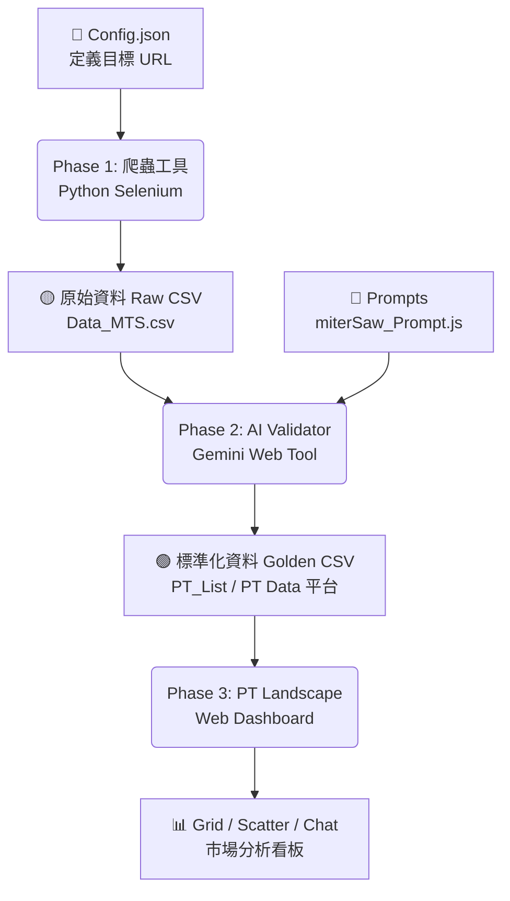

# 專案全貌與資源管理 (Project Overview & Resources)

本文件詳述 **PT Database Project** 的完整工作流、檔案架構與資源對照。專案核心目標為自動化採集電動工具數據，經 AI 清洗標準化後，提供可視化市場分析看板。

---

## 🚀 專案工作流 (Project Workflow)

資料流向：`採集 (Crawler)` ➜ `生成 (AI Validator)` ➜ `呈現 (Landscape)`

---

## 📚 階段一：自動化採集 (Crawling Phase)
**目標**：從各大電商平台抓取「生肉」數據 (Raw Data)。

*   **執行環境**: 本地 Python 環境 (Windows)
*   **核心工具**: `PT_DATA工具` (VS Code 工作區)
*   **輸入 (Input)**:
    *   `config.json`: 定義平台 URL (e.g., Toom, Obi, Hornbach)。
*   **輸出 (Output)**:
    *   `PT Data 平台 - Data_MTS.csv`: Miter Saw 原始數據。
    *   `PT Data 平台 - Data_TBS.csv`: Table Saw 原始數據。

### 📂 資源路徑
| 類型 | 名稱 | 本地路徑 (Local) | GitHub / 備註 |
| :--- | :--- | :--- | :--- |
| **主程式** | **Python GUI** | `PT_DATA工具/gui.py` | 負責調度爬蟲任務 |
| **邏輯** | **Crawler Manager** | `PT_DATA工具/crawler_manager.py` | 爬蟲核心多線程管理 |
| **設定** | **Config** | `PT_DATA工具/config.json` | 平台網址管理 |
| **產出** | **Raw CSV** | `PT_DATA工具/PT Data 平台 - Data_*.csv` | 尚未清洗的原始檔 |

---

## 🧠 階段二：AI 數據清洗與標準化 (AI Processing Phase)
**目標**：將「生肉」煮熟。透過 Gemini AI 補全缺漏規格、統一單位，並生成可篩選的標準欄位。

*   **執行環境**: 瀏覽器 (Web-based Tool)
*   **核心工具**: `PT_List工具` (HTML + Gemini API)
*   **輸入 (Input)**:
    *   來源 CSV: 來自階段一的 `Raw CSV`。
    *   Prompts: `miterSaw_Prompt.js` (定義 AI 如何讀取標題/圖片來判斷規格)。
*   **輸出 (Output)**:
    *   `PT_List.csv`: 清洗後的標準化數據 (Golden Data)。

### 📂 資源路徑
| 類型 | 名稱 | 本地路徑 (Local) | GitHub / 線上連結 |
| :--- | :--- | :--- | :--- |
| **工具 (Web)** | **AI Validator** | `PT_List工具/AI_Data_Validator_Web - Gemini版.html` | [線上版本 (可選)](https://htmlpreview.github.io/?https://github.com/eeee821022/Storage/blob/main/share/%E7%B6%B2%E9%A0%81_PT%E8%B3%87%E6%96%99%E5%BA%AB/PT_List%E5%B7%A5%E5%85%B7/AI_Data_Validator_Web%20-%20Gemini%E7%89%88.html) |
| **提示詞** | **Miter Saw Prompt** | `miterSaw_Prompt.js` | [GitHub Link](https://github.com/eeee821022/Storage/blob/main/share/%E7%B6%B2%E9%A0%81_PT%E8%B3%87%E6%96%99%E5%BA%AB/miterSaw_Prompt.js) |
| **提示詞** | **Table Saw Prompt** | `tableSaw_Prompt.js` | [GitHub Link](https://github.com/eeee821022/Storage/blob/main/share/%E7%B6%B2%E9%A0%81_PT%E8%B3%87%E6%96%99%E5%BA%AB/tableSaw_Prompt.js) |

---

## 🎨 階段三：視覺化市場看板 (Visualization Phase)
**目標**：將標準化數據呈現為互動式儀表板 (Landscape)，供決策使用。

*   **執行環境**: 瀏覽器 (Single Page Application)
*   **核心工具**: `PT Landscape.html`
*   **輸入 (Input)**:
    *   `PT_List.csv` (或整合後的 `PT Data 平台` CSV)。
    *   `https://raw.githubusercontent.com/...`: 自動從 GitHub 拉取最新數據 (若設定)。
*   **輸出 (Output)**:
    *   **Grid View**: 產品卡片陣列 (含圖片、價格、核心規格)。
    *   **Scatter View**: 價格 vs 規格分佈圖 (可截圖匯出)。
    *   **AI Chat**: 透過對話分析數據 (可下載對話紀錄 .txt)。

### 📂 資源路徑
| 類型 | 名稱 | 本地路徑 (Local) | GitHub / 線上連結 |
| :--- | :--- | :--- | :--- |
| **主程式** | **Landscape App** | `PT Landscape.html` | [部署版本 (GitHub Pages)](https://eeee821022.github.io/Storage/share/%E7%B6%B2%E9%A0%81_PT%E8%B3%87%E6%96%99%E5%BA%AB/PT%20Landscape.html) (範例) |
| **圖檔庫** | **Logos** | `PT爬蟲工具/platforms/logos` | [GitHub Logos](https://github.com/eeee821022/Storage/tree/main/share/%E7%B6%B2%E9%A0%81_PT%E8%B3%87%E6%96%99%E5%BA%AB/logos) |
| **規格書** | **Eng. Spec** | `PT_Landscape_Engineering_Spec.md` | 用於維護開發邏輯 |

---

## 🔗 網址串聯管理 (URL Integration)
專案透過 GitHub Raw Content 進行跨工具串聯，確保各端讀取到最新配置。

1.  **Logo 圖片**:
    *   URL Pattern: `https://raw.githubusercontent.com/eeee821022/Storage/main/share/%E7%B6%B2%E9%A0%81_PT%E8%B3%87%E6%96%99%E5%BA%AB/logos/{Brand}.png`
    *   用途: Landscape 卡片顯示品牌 Logo。

2.  **Prompt 規則**:
    *   URL: `https://raw.githubusercontent.com/.../miterSaw_Prompt.js`
    *   用途: AI Validator 啟動時自動載入最新 Prompt 邏輯，無需每次手動複製 JS。

3.  **CSV 數據 (Auto-Load)**:
    *   URL: `https://raw.githubusercontent.com/.../PT%20Data%20平台%20-%20Data_MTS.csv`
    *   用途: Landscape 預設載入的線上資料源 (可切換回本地上傳)。

---

## ☁️ Google Cloud & Apps Script (Legacy/Optional)
*部分舊流程或輔助功能使用 GAS，目前核心流程已轉向 Python + Client-side AI。*

*   **PT Data Platform (GAS)**: `PT_DATA_AppsScript.gs` (用於舊版 Sheets 整合)。
*   **Deploy ID**: `AKfycbxayHvv...` (見舊版文件)。
